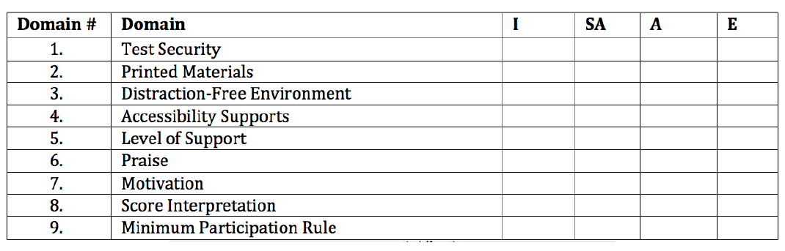

```{r setup, include=FALSE}
knitr::opts_chunk$set(echo = TRUE, eval = FALSE)
```
## Critical Element 4 - Technical Quality: Other 

### 4.1 Reliability

Test reliability can be viewed through several lenses, all of which document how
consistently an assessment performs across occasions, contexts, and raters.
Typical strategies for addressing reliability include documentation of internal
consistency, split-half reliability, and test-retest reliability. If multiple
forms are implemented, test form reliability documentation is also requisite.
The implementation plan for the ORExt includes initial documentation of internal
consistency (Cronbach's alpha). The 2015-16 technical report included
internal consistency estimates, split-half reliability analyses, as well as a
small test-retest assessment of reliability comparisons by means of our pilot
tablet administration study. There is only one test form for the ORExt, so test
form comparisons are not possible.
\newpage

#### Inter-Rater-Reliability

##### Background
ODE’s technical documentation plan (see page 136 in the 2016-17 Technical
Report), included an Inter-Rater Reliability (IRR) study for the 2017-18 school
year. Pursuant to Hallgren, K. A. (2012) the assessment of IRR may be necessary
to demonstrate consistency among observational ratings provided by multiple
assessors. The results of the study will be used to address the requirements
within the USED’s Peer Review process (Critical Element 4.1). A sample of
Oregon’s Qualified Assessors (QAs) who administer the paper/pencil version of
the Oregon Extended Assessment (ORExt) were observed to determine reliability of
administration and scoring. We did not include the tablet administration or the
Oregon Observational Rating.

##### Methods 
QTs in districts across the state observe a sample of their
respective QAs using the observation protocol (see *Appendix* 4.1
InterRater_Observation_Form) and enter their data online. The QA reads the item
stem and the student selects from three possible answer choices (A, B, or C)
then, the QA records the answer choice. QTs (observer) records the students
answer choice, then records the answer choice recorded by the QA for agreement.
Only the English Language Arts Writing porting of the ORExt requires additional
analysis by the assessor to determine if the written response (answer) meets (1)
or doesn’t meet (0) provided critera. Districts from across the state of Oregon
participated in the study, matching the state’s student population demographics,
including large, medium, and small districts, across all regions. The
observation protocol was completed for the identified QA, but the student(s) and
content area(s) observed were selected by the QT or QA. BRT researchers
contacted district-level QTs at the beginning of the test window, which runs
from February 15 - April 26, 2018, to arrange observations that could hopefully
be completed within one school day. In addition to addressing inter-rater
reliability, the study also evaluated test administration procedures. The
methods, results, and interpretation are provided here, in addition to
recommended next steps. The observation was composed of three sections:

* First, QT’s reviewed ORExt paper/pencil test preparation and administration
using the rubric (Appendix 4.1 InterRater_Observation_Form). Test
preparation/administration domains were rated on a four-point scale from
Inappropriate (I) to Exemplary (E):

    + Inappropriate (I) denotes a level of concern that could clearly affect the
    accuracy of the test results gathered from the test administration. Ratings
    at this level require substantive retraining of the QA involved.
    + Somewhat Appropriate (SA) rating denotes a level that includes some minor
    aspects that could be improved, but the accuracy of the test results are
    likely not compromised.
    + Appropriate (A) denotes a level that is consistent with all test
    administration requirements.
    + Exemplary (E) level performance suggests that the QA incorporated
    approaches to test administration that could become models for best
    practice.
     
* Second, QT’s scored the student alongside the QA using the scoring sheet. QT’s
compared results after this observation to ensure that the QA entered accurate
data.

* Finally, QT’s observed the QA completing the data entry process to ensure that
no errors are made during data entry and document the number of errors (Appendix
4.1 InterRater_Observation_Form).

###### Domain Definitions

1.	Test Security – The QA utilized a system to ensure that all test materials
were stored in a secure location,. The QA also had a district Assurance of Test
Security form on file.

2.	Printed Materials – the QA had all materials required to administer the ORExt
ready for test administration.

3.	Distraction-Free Environment – the QA arranged to provide the ORExt in a
one-on-one test administration in a location that ensured that the student
focused attention on the assessment.

4.	Accessibility Supports – the QA provided all necessary accessibility supports
for the student and ensured that all support systems were functional prior to
testing.

5.	Level of Support – The QA provided an appropriate level of support throughout
testing that did not compromise the validity of the score.

6.	Praise – The QA utilized praise appropriately to support student involvement
without leading the student to the correct answer.

7.	Motivation – The QA appropriately maintained the student’s motivation during
the assessment using relevant strategies, such as token systems.

8.	Score Interpretation – The QA demonstrated an appropriate understanding of
how to use the cut scores and achievement level descriptors to interpret scores
(i.e., ask the QA to describe how they interpret scores for parents).

9.	Minimum Participation Rule - The QA demonstrated an appropriate understanding
of the minimum participation rule (i.e., ask the QA to define the rule if it is
not used).

Qualified Assessor Testing Preparation and Administration Rubric
(Record an “X” in the cell that corresponds to your rating)

\FloatBarrier


\FloatBarrier

##### Inter-rater Agreement Results
Thirty-three Qualified Trainers from around Oregon participated in the
Inter-Rater-Reliability study by doing at least one observation on the Oregon
Extended Assessment via paper/pencil administration. Of the thirty-three
observations, 48.5% were English Language Arts, 33.3% were Mathematics, and
18.2% were Science. Observations were done at individual student’s typical
testing location. The study found a 99.3 Inter-Rater Reliability percentage
agreement between the test observers and test administrators on student item
(answer) selection.

The following two tables (Table 21 and Table 22) display the percentage of
reponses in the nine different domains and percentage of agreement between
assessors and observers.
\FloatBarrier
```{r}
library(tidyverse)
library(fs)
library(rio)
library(RColorBrewer)

d <- import("data/irr/RaterReliability.csv", setclass = "tbl_df") %>% 
  janitor::clean_names()

theme_set(theme_minimal())
  # Percentage for responses    
d %>% 
  gather(var, response, test_security:minimum_participation) %>% 
  group_by(var) %>%
  count(response)%>%
  mutate(tot = sum(n),
         percent = (n/tot)*100) %>% 
  select(-n, -tot) %>% 
  spread(response, percent, fill = 0) %>% 
  select(Exemplary, Appropriate, `Somewhat Appropriate`, Inappropriate)%>%
  kable("latex", 
        booktabs = TRUE,
        caption = "Percentage for responses",
        digits = 2) %>% 
        kable_styling(full_width = TRUE,
                      latex_options = "hold_position")
# Proportion of respondents who provide a rating of "Mark As Disagree"
d %>% 
  select(starts_with("item")) %>% 
  gather(item, response) %>% 
  count(response) %>% 
  mutate(tot = sum(n),
         percent = (n/tot)*100)%>%
kable("latex", 
        booktabs = TRUE,
        caption = "Mark As Disagree",
        digits = 2) %>% 
        kable_styling(full_width = TRUE,
                      latex_options = "hold_position")
```
\clearpage
\FloatBarrier
The following table provides a visual display of the responses from the nine
differnt domains observed.

```{r, fig.width = 8.5, fig.height= 11}

library(tidyverse)
library(fs)
library(rio)
library(RColorBrewer)


d <- import("data/irr/RaterReliability.csv", setclass = "tbl_df") %>% 
  janitor::clean_names()

theme_set(theme_minimal())
# Counts for responses
d %>% 
  gather(var, response, test_security:minimum_participation) %>% 
  group_by(var) %>%
  count(response) %>%
  mutate(response = factor(response, 
                           levels = c("Exemplary", 
                                      "Appropriate", 
                                      "Somewhat Appropriate",
                                      "Inappropriate"))) %>% 
  ggplot(aes(response, n)) +
  geom_col(aes(fill = response)) +
  scale_fill_brewer(palette = "Set1") +
  facet_wrap(~var, labeller = label_parsed) +
  guides(fill = "none") +
  labs(x = "") +
  labs(y = "") +
  theme(axis.text.x = element_text(angle = 45, vjust = 0.5, hjust=1))

```

###### Results:
ORExt's Selected response format provides for a high percentage of inter-rater
reliability. One resonse out of the 1200 observed where observes disagreed with
rateres was in the ELA Writing scoring.
'Score Interpretation' appears to be a domain in need of additional training.
Qualified Trainers indicated that 16% of observed Qualified Assessors were
Somewhat Appropriate and 8% were Inappropriate in their understanding of how to
use cut scores and achievement level descriptors to interpret scores.

###### Next Steps and Recommendations:
Additional training was provided on the QT/QA training site to ensure QT's
and QA's and using the scoring rubric provided for ELA Writing items and
appropriately scoring ELA Writing. Samples from the different types of ELA
Writing itme promps are use during the QT/QA proficiency assessment
to ensure consistency between all who administer the ORExt. Score Interpretation
training is incoporated into QT training slides and disiminated in QA
training. The score interpretation guide section of QT training has been
revisited to ensure clarity around achievement level descriptors.

#### 4.1A Test Reliability 

Marginal reliability results (true score variance/true score variance + error
variance) demonstrate that the tests are quite reliable at the total test level.
Full reliability statistics for each of the operational tests administered this
year are provided below. These results demonstrate that the total test
reliabilities were quite high, ranging from .67 to .91. Each table below
provides the content area, grade, and the marginal reliabilities. All test forms
were composed of 36 operational and 12 embedded field-test items.

```{r marginal_rel}
marg_rel <- function(theta, se) {
  s <- var(theta)
  e <- mean((se)^2)
  s/(s+e)
}
tbls <- ode %>% 
  group_by(content_area, grade) %>% 
  summarize(marg_rel = marg_rel(theta, se)) %>% 
  rename(Grade = grade, 
         `Marginal Reliability Estimate` = marg_rel) %>% 
  split(.$content_area) %>% 
  map(~ungroup(.) %>% select(-content_area))

walk2(tbls,
      paste0(c("ELA", "Math", "Reading", "Science", "Writing"),
             " Marginal Reliabilities"), 
      ~knitr::kable(.x, "latex", booktabs = TRUE,
                     caption = .y,
                    digits = 2) %>% 
        kable_styling(full_width = TRUE,
                      latex_options = "hold_position") %>% 
        print())
```
\clearpage

#### Test Information Functions 

The test information functions published below also indicate that the scales
exhibit a reliability greater than or equal to .80 for all proficient-level
cutscores.

#### English Language Arts TIFs
\FloatBarrier
{height=300px}
{height=300px}
{height=300px}
{height=300px}
{height=300px}
{height=300px}
{height=300px}
\newpage

#### Mathematics TIFs
\FloatBarrier
{height=300px}
{height=300px}
{height=300px}
{height=300px}
{height=300px}
{height=300px}
{height=300px}
\newpage

#### Science TIFs
\FloatBarrier
{height=300px}
{height=300px}
{height=300px}

#### Validation of ORExt Vertical Scales

The Test Characteristic Curves (TCCs) for the grade-level assessments in ELA and
mathematics demonstrate incrementally increasing growth and test demands across
Grades 3-8, with the exception of Grade 7 mathematics. The Grade 7 mathematics
assessment was revised to be more difficult last year, but clearly more
elaboration of this effort is needed to address its location on the TCC. Grade
11 and science tests are not vertically scaled; TCCs are thus not presented for
Grade 11 or science. All Rasch model scaling, as well as the data visualizations
for the TCCs were conducted in the R software 3.3.2 environment (R Core Team,
2016) using the r2Winsteps package (Anderson, 2015).
\FloatBarrier


\clearpage

#### 4.1B Overall and Conditional Standard Errors of Measure

The average SEM associated with each cut score for 2017-18 student data are
presented in the table below, supported by a KEY. The SEMs decreased in almost
all cases compared to last year, suggesting that the measures are more reliable
when student eligibility is more strictly controlled. See Section 4.2 below for
means and standard deviations by grade and subject area. SEM = Standard Error of
Measure associated with the cut score to the left; averaged to the tenths'
place. Level 1 = Does Not Yet Meet (not included as the lowest level of
proficiency) Level 2 = Nearly Meets Level 3	= Meets Level 4	= Exceeds

\FloatBarrier
```{r cut_score_se}
se_tbls <- ode %>% 
  filter(content_area == "ela" |
         content_area == "math" |
         content_area == "sci") %>% 
  group_by(content_area, grade, amo_lvl) %>% 
  sundry::filter_by_funs(rit, min) %>% 
  select(content_area, grade, amo_lvl, rit, rit_se) %>% 
  distinct() %>% 
  arrange(content_area, grade, amo_lvl) %>% 
  filter(amo_lvl > 1) %>% 
  rename(Grade = grade,
         AMO   = amo_lvl, 
         RIT   = rit, 
         SE    = rit_se) %>% 
  split(.$content_area) %>% 
  map(~ungroup(.) %>% select(-content_area))

walk2(se_tbls,
      paste0(c("ELA", "Math", "Science"),
             " Cut Score Standard Errors"), 
      ~knitr::kable(.x, "latex", booktabs = TRUE,
                     caption = .y,
                    digits = 2) %>% 
        kable_styling(full_width = TRUE,
                      latex_options = "hold_position") %>% 
        print())
```
\FloatBarrier

#### 4.1C Classification Accuracy & Consistency

Results from the 2017-18 ORExt test administration were analyzed using Rudner's
classification index (Rudner, 2005). Results closer to 1.0 indicate the
likelihood that a student was appropriately classified as proficient or not
proficient (accuracy) and the likelihood that the student would be classified in
the same category given an additional test administration. The calculation
utilizes item difficulty and theta value distributions, as well as related
standard errors of measurement, to generate probabilistic estimates based on one
test administration. Complete results, generated from the cacIRT package in R,
are provided below. Results denote very high levels of classification accuracy
and consistency.

\FloatBarrier
```{r class_acc}
cuts <- ode %>% 
  group_by(content_area, grade, amo_lvl) %>% 
  summarize(cut = min(theta)) %>% 
  filter(amo_lvl > 1)

diffs <- map_df(dir_ls(file.path("data", "ifiles18")), read_sub_files)

cuts <- diffs %>% 
  select(content_area, grade, difficulty) %>% 
  nest(-content_area, -grade) %>% 
  mutate(ip = map(data, ~as.matrix(data.frame(1, .$difficulty, 0))),
         content_area = tolower(content_area)) %>% 
  left_join(cuts)

abils <- ode %>% 
  nest(-content_area, -grade) %>% 
  rename(persons = data)

cuts <- left_join(cuts, abils)

acc_con_tbls <- cuts %>% 
  mutate(theta = map(persons, "theta"),
         se    = map(persons, "se"),
         marginal = pmap(list(cut, ip, theta, se), 
                         function(cut, ip, theta, se)
                         class.Rud(cut, ip, theta, se, D = 1)$Marginal),
         accuracy = map_dbl(marginal, 1),
         consistency = map_dbl(marginal, 2)) %>% 
  select(content_area, grade, amo_lvl, accuracy, consistency) %>% 
  rename(Grade = grade,
         AMO   = amo_lvl,
         Accuracy = accuracy,
         Consistency = consistency) %>% 
  split(.$content_area) %>% 
  map(~ungroup(.) %>% select(-content_area))

walk2(acc_con_tbls,
      paste0(c("ELA", "Math", "Science"),
             " Accuracy/Consistency"), 
      ~knitr::kable(.x, "latex", booktabs = TRUE,
                     caption = .y,
                    digits = 2) %>% 
        kable_styling(full_width = TRUE,
                      latex_options = "hold_position") %>% 
        print())
```
\FloatBarrier
The ORExt is not a computer-adaptive instrument so estimate precision
documentation based upon that test design is not provided.

### 4.2 Fairness and Accessibility 

The state has taken steps to ensure fairness in the development of the
assessments, including an analysis of each test item by Oregon teachers not only
for linkage to standards, but also for access, sensitivity, and bias (see
*Appendix* 3.1A). In addition, we reviewed test functioning as relevant to
race/ethnicity and disability subgroups. This process increases the likelihood
that students are receiving instruction in areas reflected in the assessment,
and also that the items are not biased toward a particular demographic or
sub-group.

##### Differential Item Functioning Analyses 

To investigate Differential Item Functioning (DIF), the Mantel-Haenszel test
using a purification process was conducted (Holland & Thayer, 1988; Kamata &
Vaughn, 2004) with the R software using the difR package (Magis et al., 2013).
When using the Mantel-Haenszel test to investigate DIF, contingency tables are
constructed, and the resulting odds for the focal group answering the item
correctly are compared to the odds for the reference group. Given n-size
limitations (Scott, et al., 2009), we were able to conduct two analyses: a)
White/Non-White and b) Male/Female. Whites and Males were the focal groups and
Non-Whites and Females were the reference groups, respectively. The contingency
table summarizes correct and incorrect responses to each item by respondents'
total raw score by subgroup (Kamata & Vaughn, 2004). If there is no difference
in performance for the two groups, the odds ratio of the focal group performance
to reference group performance will equal one. An odds ratio greater than one
means the focal group is performing better than the reference group, with the
opposite being true for odds ratios less than one. 

The difR package contains a built in algorithm to conduct purification
automatically, so we were interested in how this algorithm functioned relative
to the iterations conducted manually using SPSS. We used criteria outlined by
the Educational Testing Service (ETS) for DIF Classification (Holland & Thayer,
1988) to determine whether or not items exhibited DIF, as the difR package
reports delta values by default, defined as $$\Delta_{MH} =
-2.35*ln(\alpha_{MH})$$ <!-- ln〖(α〗_mh)=β_(〖MH〗_i ). --> <!-- where  The Holland
and Thayer criteria for ∆_MH is as follows: --> <!-- |∆_MH |≤1.0 = "A" items,
--> <!-- 1≤|∆_MH |≤1.5 = "B" items, and --> <!-- |∆_MH |≥1.5 = "C" items.  -->

The Holland and Thayer criteria were used for all Mantel-Haenszel analyses.
Items that were flagged as "C" level items were reviewed by BRT researchers for
potential biases. If biases are identified, the item is removed from the item
pool. DIF analyses were performed ex post facto on the 2015-16 ORExt operational
items to address longitudinal trends. Only three ELA items were identified as
exhibiting a "C" level DIF across both 2017 and 2018. Those three ELA items, one
in Grade 5 that exhibited DIF that privileged White examinees, one in Grade 4
that privileged Female examinees, and one in Grade 8 that privileged Female
examinees, were removed and were not used in 2017-18 or thereafter. DIF
analyses was also be performed in the 2017-18 school year to continue to
address DIF longitudinally. All items, including field test items, were included
in the analyses. There are a total of 48 items on each assessment.

Within the White/Non-White analysis, 10 out of 18 items flagged as "C" level
items privileged Non-White test participants in ELA, 2 out of 5 privileged
Non-White test participants in Mathematics, and 2 out of 7 privileged Non-White
test participants in Science. Overall, DIF flagging bases on race was relatively
balanced, with 14 privileging students who were Non-White and 16 privileging
students who were White.

\FloatBarrier
```{r dif1}
raw <- dir_ls("data/raw", glob = "*.txt")
raw <- raw[-grep("XO", raw)]

d <- map_df(raw, read_delim, delim = "|", na = "N", .id = "content") %>%
  clean_names("old_janitor") %>% 
  mutate(content = str_extract(content, "XE|XM|XS"),
         content = case_when(content == "XE" ~ "ELA",
                             content == "XM" ~ "Math",
                             TRUE ~ "Science"),
         grade_for_match = parse_number(enrlgrattst),
         grade_for_match = ifelse(grade_for_match == 12, 
                                  11, 
                                  grade_for_match)) %>% 
  gather(item, response, starts_with("item")) %>% 
  mutate(item = parse_number(item)) 

item_ids <- map_df(dir_ls("data/tests"), 
                     ~read_csv(.) %>% select(Item, `Item ID`), 
                     .id = "file") %>% 
  janitor::clean_names() %>% 
  mutate(content = str_extract(file, "ELA|Math|Science"),
         grade_for_match = as.numeric(gsub(".+/G(\\d.?)(_.+)", "\\1", file))) %>% 
  select(-file)

d <- left_join(d, item_ids) %>% 
  select(-item) %>% 
  group_by(grade_for_match, content) %>% 
  nest() %>% 
  mutate(data = map(data, ~spread(., item_id, response))) %>% 
  mutate(data  = map(data, ~remove_empty(., "cols")),
         white = map(data, ~ifelse(.[["ethniccd"]] == "W", 1, 0)),
         male = map(data, ~ifelse(.[["gndr"]] == "M", 1, 0)),
         items = map(data, ~select(., -testeventid:-tstcmpltdt)),
         items = map(items, ~map_df(., ~ifelse(is.na(.), 0, .))))

library(difR)
dif <- d %>% 
  mutate(gndr_dif = map2(items, male, ~difMH(.x, .y, 1, purify = TRUE)),
         eth_dif  = map2(items, white, ~difMH(.x, .y, 1, purify = TRUE)))

extract_grades <- function(dif_mod, items) {
  item_names <- names(items)
  delta  <- -2.35*(log(dif_mod$alphaMH))
  grades <- symnum(abs(delta), 
                   c(0, 1, 1.5, Inf), 
                   symbols = c("A", "B", "C"))
  tibble(item = item_names, delta, grades) %>% 
    mutate(grades = as.character(grades))
}
#dir.create("dif")
dif %>% 
  mutate(gndr_grades = map2(gndr_dif, items, extract_grades)) %>% 
  select(grade_for_match, content, gndr_grades) %>% 
  unnest() %>% 
  write_csv("dif/gender_dif.csv")

dif %>% 
  mutate(eth_grades = map2(eth_dif, items, extract_grades)) %>% 
  select(grade_for_match, content, eth_grades) %>% 
  unnest() %>% 
  write_csv("dif/minority_dif.csv")

gndr_tbls <- dif %>% 
  mutate(gndr_grades = map2(gndr_dif, items, extract_grades)) %>% 
  select(grade_for_match, content, gndr_grades) %>% 
  unnest() %>% 
  group_by(grade_for_match, content) %>% 
  count(grades) %>% 
  spread(grades, n, fill = 0) %>% 
  rename(Grade = grade_for_match) %>% 
  split(.$content) %>% 
  map(~ungroup(.) %>% select(-content))

minority_tbls <- dif %>% 
  mutate(eth_grades = map2(eth_dif, items, extract_grades)) %>% 
  select(grade_for_match, content, eth_grades) %>% 
  unnest() %>% 
  group_by(grade_for_match, content) %>% 
  count(grades) %>% 
  spread(grades, n, fill = 0) %>% 
  rename(Grade = grade_for_match) %>% 
  split(.$content) %>% 
  map(~ungroup(.) %>% select(-content))

walk2(minority_tbls,
      paste0(c("ELA", "Math", "Science"),
             " Differential Item Functioning Grades: White/Non-White"), 
      ~knitr::kable(.x, "latex", booktabs = TRUE,
                     caption = .y,
                    digits = 2) %>% 
        kable_styling(full_width = TRUE,
                      latex_options = "hold_position") %>% 
        print())
```
\FloatBarrier

In terms of the Male/Female analyses, 10 out of 16 items flagged as "C" level
items privileged Females in ELA, 4 out of 9 flagged items privileged Females in
Mathematics, and 8 out of 11 flagged items privileged Females in Science.
Overall, DIF flagging based on sex was relatively balanced, with 22 privileging
Females and 14 privileging Males.

```{r gndr_dif}
walk2(gndr_tbls,
      paste0(c("ELA", "Math", "Science"),
             " Differential Item Functioning Grades: Male/Female"), 
      ~knitr::kable(.x, "latex", booktabs = TRUE,
                     caption = .y,
                    digits = 2) %>% 
        kable_styling(full_width = TRUE,
                      latex_options = "hold_position") %>% 
        print())
```

\clearpage

#### Race - Ethnicity Percentages and Totals by Content Area and Grade Level 

The full ethnic and disability demographics for students taking the ORExt are
reported below. Students ethnicity/race was reported in seven categories: (a)
American Indian/Alaskan Native, (b) Asian, (c) Black or African-American, (d)
Multi-ethnic, (e) Native Hawaiian or Other Pacific Islander, (f) Hispanic, or
(g) White. The majority of students were reported as White (53-68%) or Hispanic
(12-27%). These results are largely consistent with the demographics reported
for the general assessments, though percentages taking the ORExt are slightly
higher for most students of color and generally lower for students who are Asian
or White (see *Appendix* 4.2).

```{r eth_perc}
d %>% 
  mutate(grade = map(data, "ssidenrlgrdcd"),
         ethniccd = map(data, "ethniccd")) %>% 
  select(grade, content, ethniccd) %>% 
  unnest() %>% 
  group_by(grade, content) %>% 
  count(ethniccd) %>% 
  mutate(percent = (n/sum(n))*100) %>% 
  select(-n) %>% 
  spread(ethniccd, percent, fill = 0) %>% 
  rename(Grade = grade, 
         Content = content,
         Asian = A,
         Black = B,
         Hispanic = H,
         `Am Ind` = I,
         Multiethnic = M,
         `Pac Isl` = P,
         White = W) %>% 
  kable("latex", 
        booktabs = TRUE,
        caption = "Race/Ethnicity Proportions",
        digits = 2) %>% 
        kable_styling(full_width = TRUE,
                      latex_options = "hold_position")
```

The majority of students who participated in the ORExt were students with
Intellectual Disability (30-45%) and students with Autism Spectrum Disorder (28
-34%), followed by students with Other Health Impairment (11-16%). ODE policy
for 2015-16 changed to require students who participate in the ORExt to take the
assessment in all relevant content areas. There is thus very little change in
terms of participation percentages across content areas, as evidenced by the
total n-sizes per grade level displayed below.

\clearpage

#### Exceptionality Percentages By Content Area and Grade Level

```{r disab_perc}
ode %>% 
  group_by(grade, content_area) %>% 
  count(asmtprmrydsbltycd) %>% 
  mutate(percent = (n/sum(n))*100) %>% 
  select(-n) %>% 
  spread(asmtprmrydsbltycd, percent, fill = 0) %>% 
  filter(content_area != "rdg" &
         content_area != "wri") %>% 
  rename(Grade = grade,
         Content = content_area) %>% 
  kable("latex", 
        booktabs = TRUE,
        caption = "Disability Proportions",
        digits = 2) %>% 
        kable_styling(full_width = TRUE,
                      latex_options = "hold_position")
```

#### Observed Means and Standard Deviations 

The following tables provide information regarding observed means and standard
deviations by content area and grade level. The Grade 3-8 English language arts
and mathematics scaled scores are centered on 200, while all Grade 11 scores are
centered on 900 (to reinforce that they are not on the vertical scale). Science
is centered on 500 at Grade 5 and centered on 800 at Grade 8. The vertically
scaled scores generally convey incremental gains in achievement across grade
levels, though the results suggest small losses across grades in math.These
scales were selected to clearly determine whether scores are on the same scale
and also to differentiate among the statewide assessments in use to avoid
confusion (i.e., SBA, OAKS, ORExt, ELPA, KA). The general pattern is that RIT
scores decreased from 2014-15 to 2015-16. This decrease is attributed not to the
scale, nor to deceleration of growth, but to the substantive shift in the tested
student population as a result of ODE eligibility guidelines. The scale from
2015-16 to 2016-17 appears to have stabilized because the student population
tested was more consistent.

```{r}
library(datapasta)
rit_15 <- tibble::tribble(
  ~Grade, ~ELA.Mean, ~ELA.SD, ~Math.Mean, ~Math.SD, ~Sci.Mean, ~Sci.SD,
      3L,     219.3,    24.6,      201.5,     20.8,        NA,      NA,
      4L,     222.8,    23.6,      204.8,     19.8,        NA,      NA,
      5L,     224.9,      25,      205.3,     18.1,     517.6,    25.6,
      6L,     226.3,      24,      207.7,     17.7,        NA,      NA,
      7L,     226.4,      25,      207.9,       19,        NA,      NA,
      8L,     225.4,    24.1,      207.8,     17.3,     822.1,    25.8,
     11L,     922.5,    28.5,      903.8,     21.1,     920.8,    27.7
  )
knitr::kable(rit_15, "latex", 
        booktabs = TRUE,
        caption = "Means/SDs: 2014-15",
        digits = 2) %>%  
        kable_styling(full_width = TRUE,
                      latex_options = "hold_position")

rit_16 <- tibble::tribble(
  ~Grade, ~ElA.Mean, ~ELA.SD, ~Math.Mean, ~Math.SD, ~Science.Mean, ~Science.SD,
      3L,     210.3,      23,      197.6,     20.2,            NA,          NA,
      4L,     212.3,    22.9,      198.1,     18.7,            NA,          NA,
      5L,     217.1,    24.5,      201.2,     17.2,         514.2,        22.1,
      6L,     220.1,    25.5,      204.8,     17.6,            NA,          NA,
      7L,     223.6,    28.9,      205.4,       19,            NA,          NA,
      8L,     221.2,    24.8,      206.7,     17.2,           819,        25.6,
     11L,     920.7,    27.7,      902.3,       20,           918,        24.9
  )
knitr::kable(rit_16, "latex", 
        booktabs = TRUE,
        caption = "Means/SDs: 2015-16",
        digits = 2) %>% 
        kable_styling(full_width = TRUE,
                      latex_options = "hold_position")

rit_17 <- tibble::tribble(
  ~Grade, ~ELA.Mean, ~ELA.SD, ~Math.Mean, ~Math.SD, ~Science.Mean, ~Science.SD,
      3L,    209.64,   21.73,     196.16,    18.96,            NA,          NA,
      4L,    213.13,   23.38,     198.45,    17.98,            NA,          NA,
      5L,    213.85,   25.01,     198.37,    19.54,        513.65,       24.59,
      6L,    216.65,   23.76,     203.29,    17.43,            NA,          NA,
      7L,    220.53,   23.88,     205.13,    19.87,            NA,          NA,
      8L,    219.48,   24.28,     205.92,    16.26,        817.96,       24.36,
     11L,    922.05,   26.37,     903.07,    17.57,        919.41,       24.25
  )
knitr::kable(rit_16, "latex", 
        booktabs = TRUE,
        caption = "Means/SDs: 2016-17",
        digits = 2) %>% 
        kable_styling(full_width = TRUE,
                      latex_options = "hold_position")

```

```{r obs_means}
ode %>% 
  filter(content_area != "rdg" &
         content_area != "wri") %>% 
  mutate(content_area = case_when(content_area == "ela" ~ "ELA",
                                  content_area == "math" ~ "Math",
                                  content_area == "sci" ~ "Sci")) %>% 
  group_by(grade, content_area) %>% 
  summarize(Mean = mean(rit),
            SD   = sd(rit)) %>% 
  gather(stat, val, Mean, SD) %>% 
  unite(spreader, content_area, stat, sep = " ") %>% 
  spread(spreader, val) %>% 
  rename(Grade = grade) %>% 
  kable("latex", 
        booktabs = TRUE,
        caption = "Means/SDs: 2017-18",
        digits = 2) %>% 
        kable_styling(full_width = TRUE,
                      latex_options = "hold_position")
```

\clearpage

#### Observed Means Reported by Sex 

The following tables provide information regarding average student performance
by grade level and sex (Female/Male) in each of the content areas assessed on
the ORExt. Significant differences based on a Welch two sample t-test are noted
in Grades 5 and 12 in ELA, and Grade 8 in mathematics.

```{r obs_means_sex}
eth_gndr <- d %>% 
  mutate(new = map(data, ~select(., ssidenrlgrdcd, ssid, gndr, ethniccd))) %>% 
  select(content, new) %>% 
  unnest() %>% 
  rename(grade = ssidenrlgrdcd,
         content_area = content) %>% 
  mutate(content_area = tolower(content_area),
         content_area = ifelse(content_area == "science", "sci", content_area),
         grade = as.numeric(grade)) 
  

ode <- left_join(ode, eth_gndr)

ode %>% 
  filter(content_area != "rdg" &
         content_area != "wri") %>% 
  mutate(content_area = case_when(content_area == "ela" ~ "ELA",
                                  content_area == "math" ~ "Math",
                                  content_area == "sci" ~ "Sci")) %>% 
  group_by(grade, content_area, gndr) %>% 
  summarize(Mean = mean(rit),
            SD   = sd(rit)) %>% 
  gather(stat, val, Mean, SD) %>% 
  unite(spreader, content_area, stat, sep = " ") %>% 
  spread(spreader, val) %>% 
  rename(Grade = grade,
         Sex   = gndr) %>% 
  kable("latex", 
        booktabs = TRUE,
        caption = "Means/SDs by Gender: 2017-18",
        digits = 2) %>% 
        kable_styling(full_width = TRUE,
                      latex_options = "hold_position")
```

\clearpage

#### Observed Means Reported by Race 

The following table provides information regarding average student performance
by grade level and race/ethnicity in each of the content areas assessed on the
ORExt.

```{r eth_means}
eth_descrip_tbls <- ode %>% 
  filter(content_area != "rdg" &
         content_area != "wri") %>% 
  mutate(content_area = case_when(content_area == "ela" ~ "ELA",
                                  content_area == "math" ~ "Math",
                                  content_area == "sci" ~ "Sci")) %>% 
  group_by(grade, content_area, ethniccd) %>% 
  summarize(Mn = mean(rit),
            SD   = sd(rit)) %>% 
  gather(stat, val, Mn, SD) %>% 
  unite(spreader, content_area, stat, sep = " ") %>% 
  spread(spreader, val) %>% 
  rename(Grade = grade,
         `Eth Code` = ethniccd) %>% 
  split(.$Grade) %>% 
  map(~ungroup(.) %>% 
        select(-Grade) %>% 
        remove_empty("cols"))

eth_descip_captions <- paste0("Grade ", 
                              names(eth_descrip_tbls),
                              " Means/SDs by Race/Ethnicity: 2017-18")
walk2(eth_descrip_tbls, eth_descip_captions,
      ~kable(.x, 
             "latex", 
             booktabs = TRUE,
             caption = .y,
             digits = 2) %>% 
        kable_styling(full_width = TRUE,
                      latex_options = "hold_position") %>% 
        print())
```

\clearpage

#### Observed Means Reported by Exceptionality Status 

The following table is a number key for **Elibibility Codes:**

##### Eligibility Codes List
*  0  Not Applicable
* 10	Intellectual Disability
* 20	Hearing Impairment
* 40	Vision Impairment
* 43	Deafblindness
* 50	Communication Disorder
* 60	Emotional Disturbance
* 70	Orthopedic Impairment
* 74	Traumatic Brain Injury
* 80	Other Health Impairment
* 82	Autism Spectrum Disorder
* 90	Specific Learning Disability

The following tables provide information regarding average student performance
by grade level and exceptionality category in each of the content areas assessed
on the ORExt. Students with SLD were generally the highest performing group,
though students with ED performed higher at certain grade levels/content
areas. The lowest performing group was consistently students with VI.
\FloatBarrier
```{r disab_means}
disab_descrip_tbls <- ode %>% 
  filter(content_area != "rdg" &
         content_area != "wri") %>% 
  mutate(content_area = case_when(content_area == "ela" ~ "ELA",
                                  content_area == "math" ~ "Math",
                                  content_area == "sci" ~ "Sci")) %>% 
  group_by(grade, content_area, asmtprmrydsbltycd) %>% 
  summarize(Mean = mean(rit),
            SD   = sd(rit)) %>% 
  gather(stat, val, Mean, SD) %>% 
  unite(spreader, content_area, stat, sep = " ") %>% 
  spread(spreader, val) %>% 
  rename(Grade = grade,
         `Dis Code` = asmtprmrydsbltycd) %>% 
  split(.$Grade) %>% 
  map(~ungroup(.) %>% 
        select(-Grade) %>% 
        remove_empty("cols"))

disab_descrip_captions <- paste0("Grade ", 
                              names(disab_descrip_tbls),
                              " Means/SDs by Race/Ethnicity: 2017-18")
walk2(disab_descrip_tbls, disab_descrip_captions,
      ~kable(.x, 
             "latex", 
             booktabs = TRUE,
             caption = .y,
             digits = 2) %>% 
        kable_styling(full_width = TRUE,
                      latex_options = "hold_position") %>% 
        print())
```
\clearpage

#### Graphs of Observed Means By Disability 

The graphs below convey information similar to that shared above in graphic
form. The graphics include 95% confidence interval error bars, so determining
which subgroups performed in a manner that is significantly better than others
is readily apparent by looking at the location of the error bars. Error bars
that do not overlap in terms of the y-scale are significantly different.
Students with VI are again the lowest performing group. Students with SLD are
consistently outperforming most peers. Students with VI are consistently the
lowest performing group, which led to concerns regarding test accessibility.
\FloatBarrier
```{r rit_excep_plots}
excep_plots <- ode %>% 
  filter(content_area == "ela" |
         content_area == "math") %>% 
  group_by(content_area, grade, asmtprmrydsbltycd) %>% 
  summarize(mean = mean(rit),
            se   = sundry::se(rit)) %>% 
  mutate(lower_bound = mean + qnorm(0.025)*se,
         upper_bound = mean + qnorm(0.975)*se) %>%
  ungroup() %>% 
  nest(-content_area) %>% 
  mutate(
    content_area = c("English/Language Arts", "Math"),
    plot38 = map2(data, content_area,
      ~ggplot(filter(.x, grade < 11), aes(factor(asmtprmrydsbltycd), mean)) +
        geom_errorbar(aes(ymin = lower_bound, ymax = upper_bound),
                      color = "gray80") +
        geom_point(aes(color = factor(asmtprmrydsbltycd))) +
        facet_wrap(~grade) +
        scale_color_brewer("Disability Code", palette = "Set3") +
        labs(y = "Mean",
             title = paste0("Means by Disability Category"),
             subtitle = .y) +
        theme(axis.title.x=element_blank(),
              axis.text.x=element_blank(),
              axis.ticks.x=element_blank(),
              legend.position = "bottom")),
    plot12 = map2(data, content_area,
      ~ggplot(filter(.x, grade > 8), aes(factor(asmtprmrydsbltycd), mean)) +
        geom_errorbar(aes(ymin = lower_bound, ymax = upper_bound),
                      color = "gray80") +
        geom_point(aes(color = factor(asmtprmrydsbltycd))) +
        facet_wrap(~grade) +
        scale_color_brewer("Disability Code", palette = "Set3") +
        labs(y = "Mean",
             title = paste0("Means by Disability Category"),
             subtitle = .y) +
        theme(axis.title.x=element_blank(),
              axis.text.x=element_blank(),
              axis.ticks.x=element_blank(),
              legend.position = "bottom")))
```

\FloatBarrier
```{r plots38, fig.height=8}
walk(excep_plots$plot38, print)
```

\FloatBarrier
```{r plots11}
walk(excep_plots$plot12, print)
```

\FloatBarrier
```{r sci_excep_plots}
sci_excep_plots <- ode %>% 
  filter(content_area == "sci") %>% 
  group_by(grade, asmtprmrydsbltycd) %>% 
  summarize(mean = mean(rit),
            se   = sundry::se(rit)) %>% 
  mutate(lower_bound = mean + qnorm(0.025)*se,
         upper_bound = mean + qnorm(0.975)*se) %>%
  ungroup() %>% 
  nest(-grade) %>% 
  mutate(
    plot = map2(data, grade,
      ~ggplot(.x, aes(factor(asmtprmrydsbltycd), mean)) +
        geom_errorbar(aes(ymin = lower_bound, 
                          ymax = upper_bound),
                      color = "gray80") +
        geom_point(aes(color = factor(asmtprmrydsbltycd))) +
        scale_color_brewer("Disability Code", palette = "Set3") +
        labs(y = "Mean",
             title = paste0("Means by Disability Category"),
             subtitle = paste0("Science: Grade ", .y)) +
        theme(axis.title.x=element_blank(),
              axis.text.x=element_blank(),
              axis.ticks.x=element_blank(),
              legend.position = "bottom")))
```

\FloatBarrier
```{r sci_plots5811}
walk(sci_excep_plots$plot, print)
```


### 4.3 Full Performance Continuum 

The ORExt is designed to sample the Common Core State Standards in English
language arts (Reading, Writing, and Language) and Mathematics, as well as the
Oregon Science Standards and Next Generation Science Standards in science in a
purposive, validated manner. The ORExt test blueprints convey the balance of
representation exhibited by the assessment (see *Appendix* 2.1B). These test
blueprints are supported by the \color{link}[ORExt Extended Assessment
Frameworks](http://www.brtprojects.org/publications/training-modules)\color{black},
which define the assessable content on the ORExt that has been reduced in depth,
breadth, and complexity (RDBC) using our defined process (see *Appendix*
2.3A.3). The decisions regarding which standards to target for essentialization,
as well as the strength of linkage between the Essentialized Standards and the
CCSS/ORSci/NGSS has been validated by Oregon teachers, as well (see *Appendix*
3.1A).

Though a simplified and standardized approach was taken to design items, and
efficiency and access to the assessment increased for the majority of students
(as evidenced by the decreased percentages of zero scores across all content
areas), a small subgroup of students remains who cannot access an academic
assessment. This is true even though items have been significantly RDBC at three
levels of complexity (low-medium-high difficulty). As a response, ODE
commissioned BRT to design and implement an observational rating scale for this
group of very low-performing students, called the Oregon Observational Rating
Assessment (ORora) for the spring 2016 administration. The ORora targets
communication (expressive and receptive) and basic skills (attention/joint
attention and mathematics) and provides documentation of student progress
outside of our clearly defined academic domains.

Items on all assessments were scored on a 2-point scale, with 1 point awarded
for a correct response and 0 points awarded for an incorrect response. Plots are
provided below for each content area and grade level, including the person
ability and item difficulty distributions. In general, the descriptive
statistics suggest that the test had an appropriate range of item difficulties
represented, from easy to difficult, with item difficulties generally ranging
from -4.0 to +4.0 on the Rasch scale. The assessments performed as expected
across all grades and content areas. The item person distributions provided
below demonstrate that the ORExt is providing a performance continuum for
students who participate.

#### English Language Arts Person/Item Distributions
\FloatBarrier
{height=300px}
{height=300px}
{height=300px}
{height=300px}
{height=300px}
{height=300px}
{height=300px}
\clearpage

#### Mathematics Person/Item Distributions
\FloatBarrier
{height=300px}
{height=300px}
{height=300px}
{height=300px}
{height=300px}
{height=300px}
{height=300px}
\clearpage

#### Science Person/Item Distributions
\FloatBarrier
{height=300px}
{height=300px}
{height=300px}


### 4.4 Scoring 

All scoring expectations for the ORExt are established within the Administration
Manual (see *Appendix* 2.3, p. 14). The scoring procedures for the new ORExt
have been simplified, with students receiving a 0 for an incorrect response or a
1 for a correct response. Input from the field gathered from Consequential
Validity studies demonstrates that the assessment scoring procedures are much
more clear and easier to implement than prior scoring approaches (see *Appendix*
2.3B.10). BRT was also commissioned to develop a scaled score interpretation
guide, which describes specific strategies for interpreting student test scores
and sub-test scores in Reading and Writing, and Achievement Level Descriptors
(ALDs) published within the Individual Student Reports (see *Appendix* 6.4C) for
annual performance, growth, and as part of Essential Skills requirements for
very low performing students (see *Appendix* 2.1A).

### 4.5 Multiple Assessment Forms 

The ORExt was administered in only form per subject area and grade level for the
2017-18 school year, with 36 operational items arranged in order of empirical
difficulty and 12 embedded field test items.

### 4.6 Multiple Versions of An Assessment 

The ORExt is provided in the standard format, but is also available in Large
Print and Brailled formats. Test content is identical across all three versions,
with an occasional item being eliminated on the Braille version due to
inaccessibility. These items do not count for or against the student in
reporting. Substantive test comparability analyses are not feasible, given the
small n-sizes of the samples involved in the alternative versions.

### 4.7 Technical Analyses and Ongoing Maintenance 

The ORExt technical analyses that document reliability and validity are included
in this technical report (see Sections 3 and 4, respectively). ODE and BRT staff
review these analyses annually. Necessary adjustments to the assessment are
determined prior to implementation of the subsequent year's work plan, which
elaborates the areas of improvement as well as aspects of the testing program
that will be maintained. This decision-making is supported by input from the
field gathered from the Consequential Validity study (see *Appendix* 2.3B.10).

Within our system of ongoing improvement is continuation of the development of
additional curricular and instructional resources. This addresses an area of
concern expressed by stakeholders. Training modules and templates continue to be
developed to connect assessment results from the ORExt and ORora with curricular
resources and instructional strategies aligned to the standards.